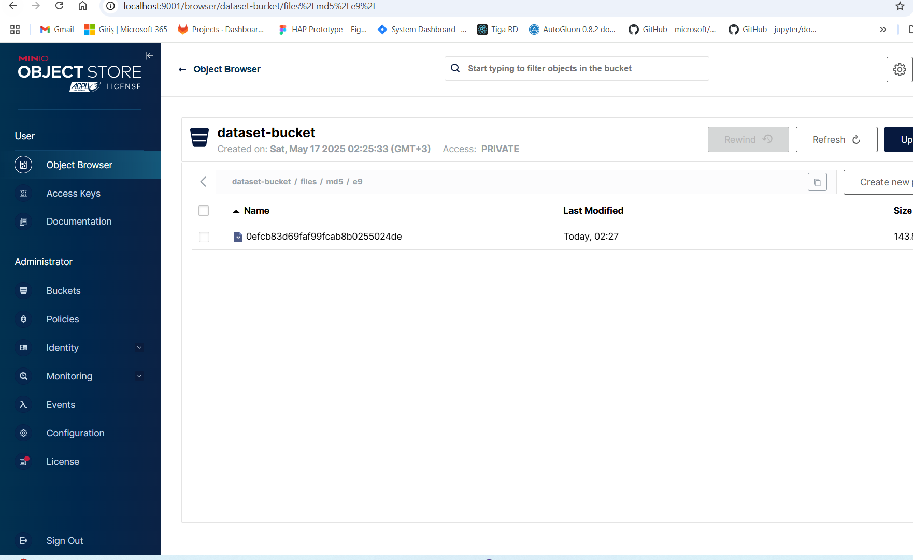
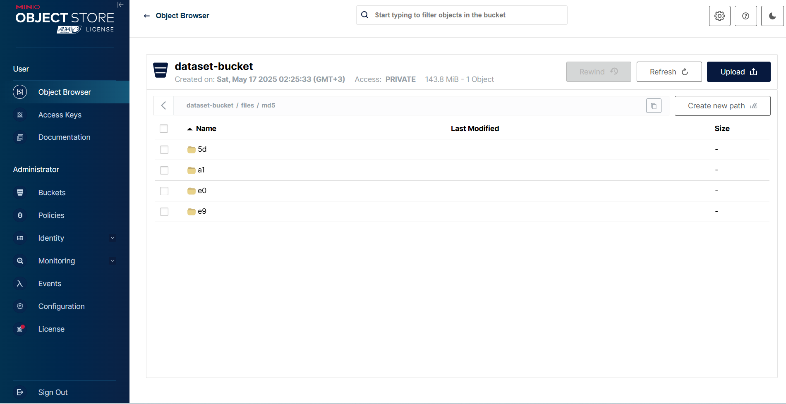
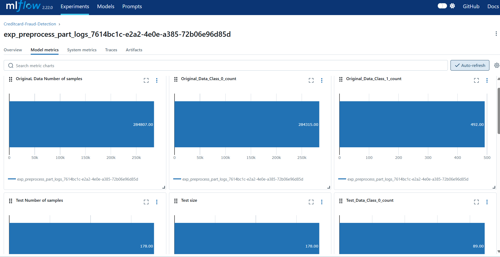
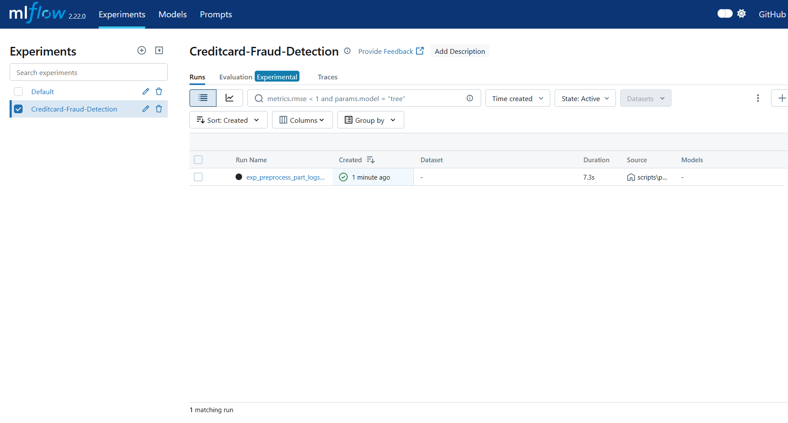
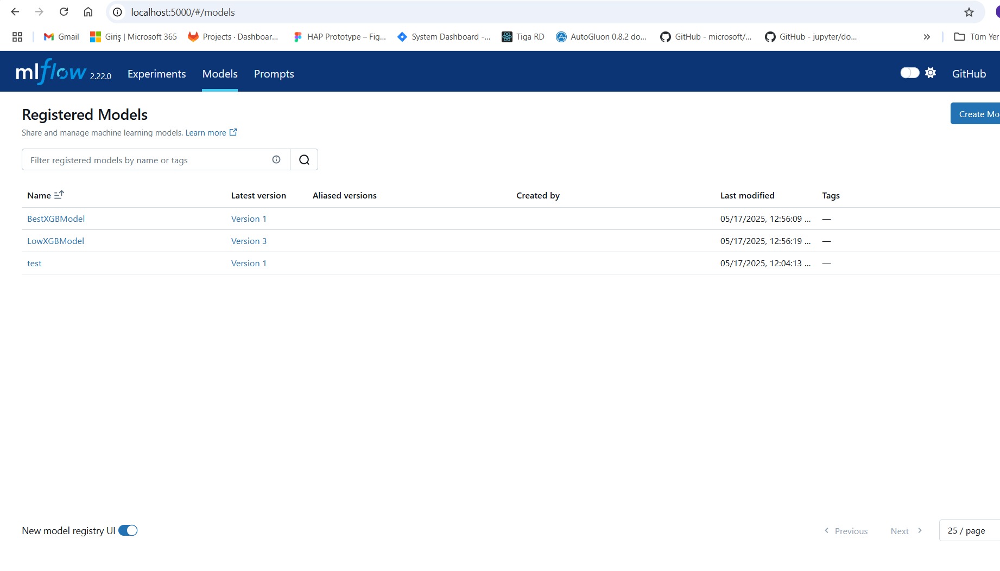
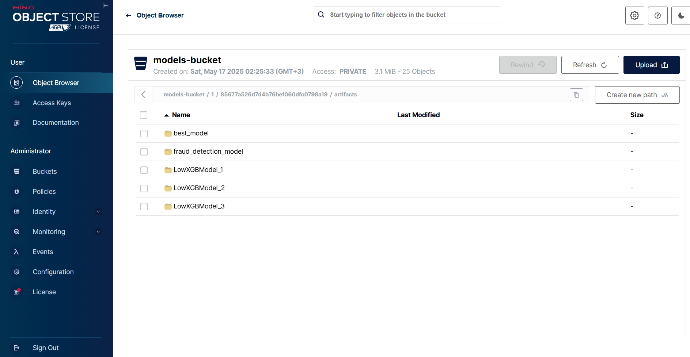
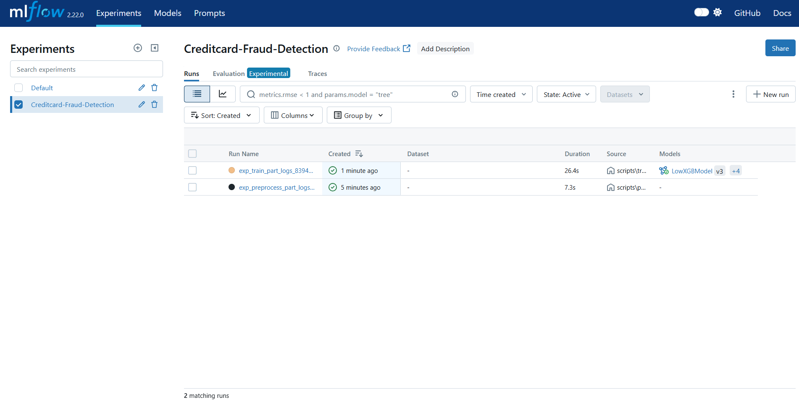
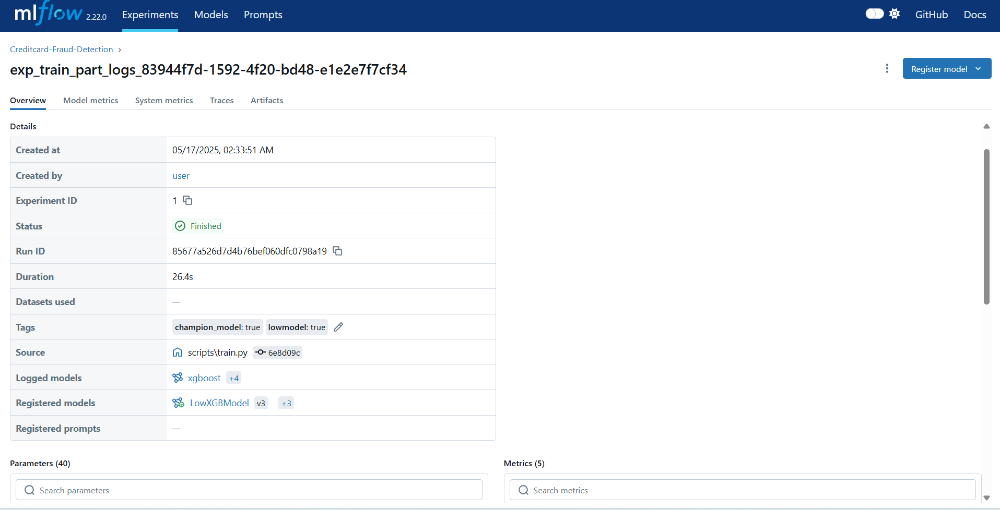
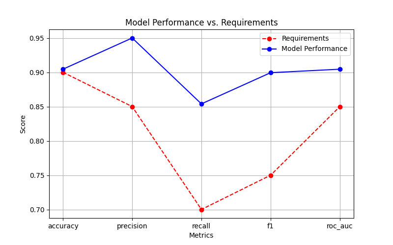
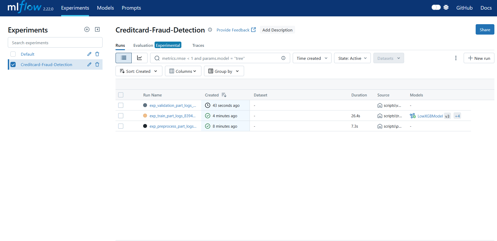

# ML ENDPOİNT SERVICE AND MODEL REGISTRY

ML model inference service solution and how to make model registry is included in this repo. To run this solution please follow steps below

# Prerequisites for Testing, Training, and Preprocessing
To ensure a smooth setup and execution of our testing, training, and preprocessing workflows, the following dependencies must be installed:
- Operating System: Windows (WSL required)
- Docker Desktop: Necessary for containerized environments
- WSL (Windows Subsystem for Linux): Required for compatibility and execution
- Python: Version 3.12 must be installed for preprocessing and related tasks
- Git: Required for version control
- DVC (Data Version Control): Needs Git to function properly
Before proceeding, ensure all tools are properly installed and configured.
# How to run
* Please use a windows 11 machine for docker service host
* In order to run the solution first of all make sure that  Docker version 24.0.6 i running on host machine
* In order to run the solution  make sure that python 3.13 or higher is installed in your env

## Step 1 
* Clone this repo with and change working directory to this repo
```
git clone https://github.com/Atsyurt/mlops_tracking_server.git
cd mlops_tracking_server


```
## step 2
* Install python dependencies
```
pip install -r requirements.txt
```


## step 3
* Please note that i used mlflow for mlops system
* First of all You should build the infrastructre with this  docker compose file use this cmd in order to run mlflow tracking,mlflow backend, artifacts store and data storage
```
docker compose build
```
* Get Docker services up and running

```
docker compose up
```
* Right now your mlflow service should be accessible from
[Mlflow tracking ](http://localhost:5000)


* Minio srvice should be accessible from
[Minio ](http://localhost:9000)--->(http://localhost:9001)


## step 4
* Run setup.py inorder to setup dvc data download

```
python scripts\setup.py

```
* original dataset pushed to Minio srvice should be similiar like this



* original dataset saved as "localv_1" tag version
* use this cmd to see this version
```
git tag
```

## step 5
* Run preprocess.py inorder to setup dvc data preprocess

```
python scripts\preprocess.py --data-rev localv_1

```
* you can check outputs like these





* Processed datasets saved as "localv_1_processed" tag version

* if you want to see original dataset and processed versions run
 ```

git tag

```
* You should see similiar output
 ```
localv_1
localv_1_processed
```
* you can switch speicific local dataset version by using
 ```
git checkout localv_1
dvc checkout

or

git checkout localv_1_processed
dvc checkout
 ```


## step 6
* Run train.py script in order to train model

```
python scripts\train.py --data-rev localv_1_processed

```
* Registered model list can be accessible from:
[Reg. Models ](http://localhost:5000/#/models)


* you can check other outputs like these




## step 7
* Run validate.py script, in order to validate model

```
python scripts\validate.py --model-version 1 --data-rev localv_1_processed  --start-api
```
* Vis. artifacts  should be accessible artifacts session of the related run, like this one:


* you can check other outputs like these



## Some Usefull cmds(just look if you want,dont execute)
*Set remote storage for the dataset and add original data for initila commit with dvc here s some usefull cmds for the dvc with git
```
git log --oneline
git checkout 839ed86 dataset\creditcard-data.csv.dvc
dvc checkout

git rm --cached dataset\creditcard-data.csv.dvc
dvc remove dataset\creditcard-data.csv.dvc

dvc add dataset\creditcard-data.csv

dvc remote modify minio access_key_id user
dvc remote modify minio secret_access_key WW4e69Wwcv0w
dvc remote add -d minio s3://dataset-bucket -f
dvc remote modify minio endpointurl http://localhost:9000
git add dataset\creditcard-data.csv.dvc

```
* Since DVC works alongside Git, you should first commit your changes and then create a tag:
```
git tag -a v1.0 -m "Data version 1.0"
git checkout v1.0
dvc checkout
git push origin v1.0
git tag
```

*Note  if credientals are not working set credientals with env varibles for example in windows os
<!-- set AWS_ACCESS_KEY_ID=user
set AWS_SECRET_ACCESS_KEY=WW4e69Wwcv0w -->

## Final
* I used MLflow, Git, DVC, MinIO, and PostgreSQL to build the MLOps system.
* Developed on Windows 11.
* For version control, I utilized Git tags locally.
* I separated the logs for preprocess.py, train.py, and validate.py in MLflow to enhance clarity. (Although I could combine them into a single run, I prefer keeping them separate for better readability.)
* If you want to reproduce the results, please follow the steps starting from Step 1.


## Contact

Ayhan Taşyurt -  [ayhantsyurt](mailto:ayhantsyurt@gmail.com)